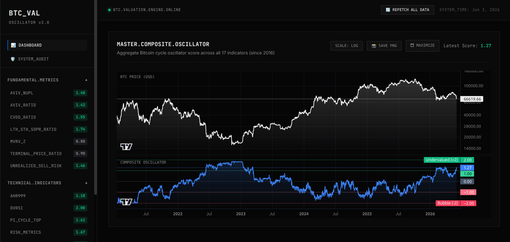
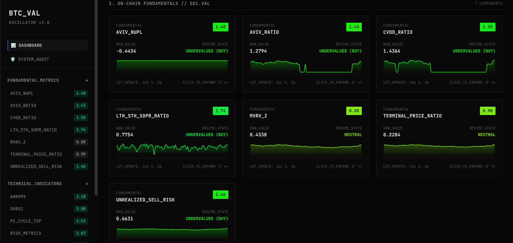
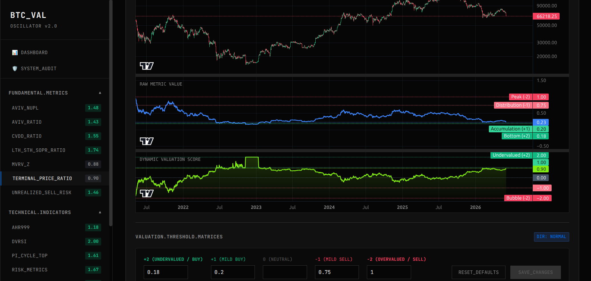
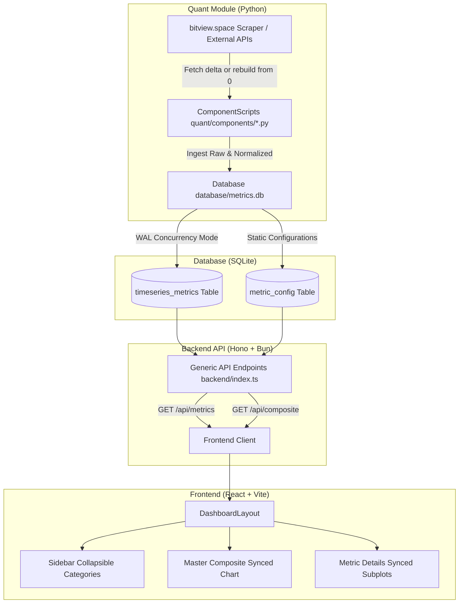

<div align="center">
  
  # 📈 Quant BTC Cycle Valuation System
  
  **A quantitative and statistical valuation engine designed to aggregate on-chain, technical, and sentiment metrics to pinpoint macroeconomic Bitcoin cycle peaks, troughs, and transition phases.**

  [](https://www.python.org/)
  [](https://bun.sh/)
  [](https://hono.dev/)
  [](https://vite.dev/)
  [](https://react.dev/)
  [](https://www.sqlite.org/)

  <br />
</div>

---

## 📖 Project Name and Description

### Quant BTC Cycle Valuation System
The **Quant BTC Cycle Valuation System** is a statistical quantitative model that aggregates macroeconomic indicators across three main pillars to calculate the **Master Valuation Oscillator** bounded strictly between `-2` (extreme undervalued / cycle bottom) and `+2` (extreme overvalued / cycle peak). 

By using piecewise linear interpolation against historical standard-deviation (SD) thresholds, the system converts raw metrics of different scales (ratios, scores, percentages) into a unified cycle oscillator, providing long-term investors and quantitative researchers with clear, real-time macroeconomic context of Bitcoin cycle dynamics.

---

## 📸 Screenshots

### Master Composite Dashboard


### Metrics Grid View


### Custom Threshold per Metric Configuration


---

## 💻 Technology Stack

* **Quant Core (Statistical Engine):** [Python 3.10+](https://www.python.org/) utilizing `Pandas`, `NumPy`, and `Requests` for historical data scraping, mathematical model execution, and ingestion.
* **Backend API Service:** [Hono](https://hono.dev/) web framework running on the [Bun](https://bun.sh/) JavaScript runtime, utilizing Hono Router for extremely fast local serving.
* **Frontend Application:** [React](https://react.dev/) SPA scaffolded with [Vite](https://vite.dev/), powered by TypeScript and customized with **TradingView's [Lightweight Charts](https://github.com/tradingview/lightweight-charts)**.
* **Local Database Engine:** [SQLite](https://www.sqlite.org/) in **WAL (Write-Ahead Logging)** mode, providing safe, simultaneous high-concurrency read/write operations between Python ingestion scripts and the Bun backend.
* **Package Management:** **Bun** (`bun install`) for JavaScript/TypeScript, and `pip` (`python -m pip`) for Python virtualenv management.

---

## 🏗 Project Architecture

Logic flows strictly according to the progressive disclosure boundaries outlined in `openspec/design.md`. The diagram below illustrates the modular architecture of the system:



### Architectural Safeguards:
1. **One Component = One Python Script:** Each indicator pipeline behaves as an isolated "Component Playground" script. This decoupling allows quant developers to easily backtest and adjust formulas without impacting the API.
2. **Generic API serving:** API handlers dynamically load metric histories, avoiding hardcoded endpoint growth.
3. **Decoupled Synchronized Charts:** Time-alignment is performed using strict outer-joins, padding missing intervals so that dual/triple charts share identical logical scales and align perfectly on HMR crosshair moves.

---

## 🚀 Getting Started

### Prerequisites
* **Bun Runtime** (latest)
* **Python 3.10+** (with virtual environment capability)
* **Git**

### Installation & Setup

1. **Clone the repository and enter workspace:**
   ```bash
   git clone https://github.com/lutfi-zain/quant-btc-valuation-system.git
   cd quant-btc-valuation-system
   ```

2. **Set up Python Virtual Environment & Install Dependencies:**
   ```bash
   python -m venv .venv
   source .venv/bin/activate  # On Windows use: .venv\Scripts\activate
   python -m pip install -r requirements.txt
   ```

3. **Install Bun Dependencies:**
   ```bash
   bun install
   ```

4. **Seed Database Configurations & Run Data Pipeline Ingestion:**
   ```bash
   python -m quant.seed_metric_config
   python -m quant.run_all --rebuild
   ```
   *(This downloads and normalized historical datasets since 2016 for all 17 components).*

5. **Start Hono Backend Server:**
   ```bash
   cd backend
   bun run index.ts
   ```

6. **Start React Frontend Server (Vite):**
   ```bash
   cd frontend
   bun run dev
   ```

Open your local browser to **[http://localhost:5173/](http://localhost:5173/)** to access the dashboard.

---

## 📁 Project Structure

```
quant-btc-valuation-system/
├── backend/                  # Hono-based API backend service
│   ├── index.ts              # Core API endpoints & DB connection handlers
│   ├── index.test.ts         # Integration test suite (Bun test)
│   └── package.json          
├── database/                 # SQLite database & schemas
│   ├── db.py                 # SQLite WAL connection seeder
│   └── metrics.db            # Active database file containing metrics history
├── docs/                     # Quantitative research documentation
│   └── components.md         # Expert thresholds, descriptions, and formulas
├── frontend/                 # Vite-React frontend codebase
│   ├── src/
│   │   ├── api/client.ts     # Bun-compatible API client wrappers
│   │   ├── components/       # Synced subplots, Sidebar, MetricDetail, MetricCard
│   │   ├── types/metrics.ts  # VerbatimModuleSyntax compliant interfaces
│   │   └── utils/colors.ts   # HSL interpolators for normalized scores
│   └── package.json          
├── openspec/                 # OpenSpec specifications, designs & proposals
│   └── config.yaml           # authorative project rules & style guides
└── quant/                    # Python quantitative module
    ├── components/           # 17 standalone ComponentScripts playgrounds
    ├── run_all.py            # CLI pipeline orchestrator
    └── tests/                # Pytest coverage testing suite
```

---

## ✨ Key Features

* **Unified Valuation Scale:** Conforms 17 quantitative indicators onto a synchronized `-2` to `+2` scale.
* **Collapsible Sidebar Categories:** Grouped by ubiquitous DDD pillars (**Fundamental**, **Technical**, and **Sentiment**).
* **Master Composite Oscillator Chart:** Synergizes a **Dual-Subplot TradingView Chart** featuring log-scale BTC Price aligned with the overall valuation score arithmetic mean.
* **Three-Pane Synced Detailed View**: Instantly drill down into a metric to display:
  * **Top Subplot**: BTC Candlestick OHLC chart.
  * **Middle Subplot**: Raw Metric Value (showing dynamic horizontal lines representing your custom thresholds).
  * **Bottom Subplot**: Normalized valuation score.
* **Interactive Log/Linear Price Scale:** Supports live scaling changes on both Master and Detailed charts.
* **Incremental Delta Fetching**: Avoids heavy rate-limiting by automatically pulling only new points, with an option to `--rebuild` from 0.

---

## 🔄 Development Workflow

We strictly practice **Spec-Driven Development** supported by **OpenSpec**:
1. **Proposal Phase:** All modifications begin as a proposal (`proposal.md`) outlining goals, scopes, and target models.
2. **Specification & Design:** DB schemas, TypeScript interfaces, and API endpoints are mapped explicitly in `specs/` and `design.md`.
3. **Execution Tasks:** Tasks list specific steps, manual validations, and automated testing requirements.
4. **Git Branching Strategy:**
   * Branch features off `feature/<name>`.
   * **Commit format:** Conventional Commits (`feat(...)`, `fix(...)`, `test(...)`).
   * **No Force Pushes (`git push --force` or `--force-with-lease` are prohibited):** Always `git pull --rebase` first, resolve conflicts locally, and push normally.

---

## 📏 Coding Standards

* **TypeScript type imports:** verbatimModuleSyntax is active. Strictly use `import type` for interfaces to avoid runtime syntax failures under transpilation bundler modes.
* **No Private Fields Serialization:** Do not use private underscore-prefixed fields (e.g. `_field`) in serialized API models to guarantee safe serialization in modern Pydantic v2/JSON decoders.
* **Ubiquitous Language:** Code logic, endpoints, and variables must strictly adhere to domain terms: `ValuationOscillator`, `ValuationMetric`, `ComponentScript`, `OnChainMetric`, `SentimentIndicator`, `TechnicalIndicator`, and `BTCValuationModel`.

---

## 🧪 Testing

We require 100% testing on all modifications. Ensure all tests pass before proposing updates:

* **Python Automated Tests (Fast Validation):**
  ```bash
  python -m pytest -xvs
  ```
* **Python Coverage Analysis:**
  ```bash
  python -m pytest --cov
  ```
* **Backend Endpoint Tests:**
  ```bash
  cd backend && bun test
  ```
* **Frontend Component Tests:**
  ```bash
  cd frontend && bun test
  ```

---

## 🤝 Contributing

Guidelines for contributing to the BTC Cycle Valuation System:
1. Ensure `init_db()` is correctly executed on start to prevent missing config errors.
2. Ensure new components inherit from `BaseComponent` and implement both `fetch_data()` and `normalize()`.
3. Run complete verification (`python -m pytest --cov` + `bun test`) and local Hono backend verification before committing.
4. Always ask first before changing project structures or installing external libraries.

---

## 📄 License

This repository is licensed under the MIT License. Feel free to use, modify, and distribute for quantitative research.
