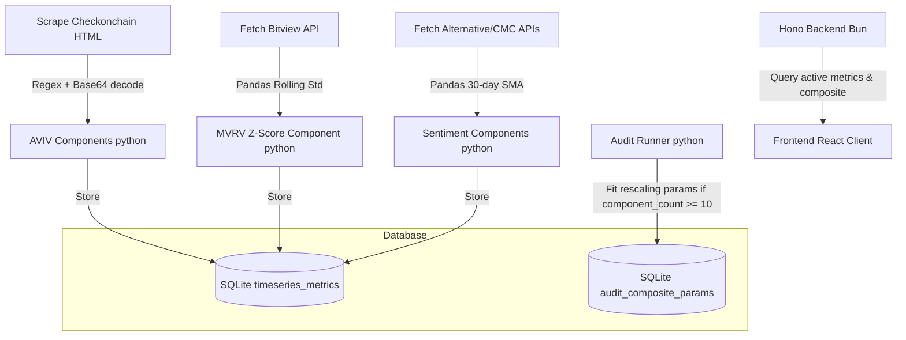

## Context

The Bitcoin Cycle Valuation System aggregates 17 on-chain, technical, and sentiment indicators to construct a master valuation oscillator bounded between [-2, +2]. In its current state:
1. **AVIV metrics** suffer from feed discrepancies because of local calculations from Bitview data compared to official checkonchain.com reference charts.
2. **MVRV Z-Score** suffers from historical saturation due to global standard deviation calculations which lock early years (2009-2016) price action in a flatline.
3. **One-sided metrics** (like CVDD Ratio and Unrealized Sell Risk) return `0.0` (neutral) when outside their active range, which artificially pulls the Composite Oscillator average towards neutral and dampens cyclical extreme signals.
4. **Collinearity and double-counting** exist because both `aviv_ratio` and `aviv_nupl` are included in the equal-weighted Composite Oscillator calculation, despite their perfect rank correlation.
5. **High-frequency noise** is injected by raw daily/weekly sentiment indexes.
6. **Calibration distortion** occurs because the statistical audit runner fits composite rescaling percentiles across the entire database history, including early years with very few components active.

## Goals / Non-Goals

**Goals:**
- Scrape checkonchain.com directly for `aviv_ratio` and `aviv_nupl` metrics to guarantee exact alignment.
- Implement a 4-year (1,460-day) rolling standard deviation window for `mvrv_z` Z-Score calculations.
- Implement 30-day SMA smoothing on `fear_greed_og` and `fear_greed_cmc` sentiment indicators.
- Update the normalizer to return `NaN` (NULL in SQLite) for one-sided metrics outside their active zone.
- Exclude `aviv_nupl` from the Composite average calculation.
- Update the statistical audit runner to fit composite rescaling parameters only on dates with at least 10 active components.

**Non-Goals:**
- Changing the SQLite database tables schema.
- Implementing multi-asset support.
- Altering the fundamental piecewise linear interpolation framework.

## Decisions

### Decision 1: Direct Plotly Scraper & Decoder
- **Rationale**: Fetching raw data from third-party endpoints and reconstructing Cointime metrics locally results in rounding and feed discrepancies. By parsing the exact Plotly HTML charts from checkonchain.com, we can extract the true series.
- **Approach**: Fetch chart HTML, extract the trace data using regex to match `Plotly.newPlot(...)`, decode the base64-encoded binary float64 array (`f8`) mapped under `trace['y']['bdata']`, and align it with the ISO dates in `trace['x']`.
- **Alternatives considered**: Continuing to use bitview.space feeds with a local approximation. Rejected because it fails to match official charts.

### Decision 2: 4-Year (1,460-day) Rolling Window for MVRV Z-Score
- **Rationale**: Standard deviation calculated globally across Bitcoin's history is heavily skewed by the massive nominal volatility of later years, squashing early-years values close to 0. A 4-year (1,460-day) rolling window adapts the Z-score calculation to local volatility regimes.
- **Approach**: Compute Z-score as `(market_cap - realized_cap) / rolling_stddev(market_cap, window=1460)` using pandas `rolling(1460).std()`.
- **Alternatives considered**: Expanding standard deviation. Rejected because it retains long-term homoscedasticity bias.

### Decision 3: One-Sided Metric NULL Exclusion
- **Rationale**: Returning `0.0` (neutral) when an indicator is inactive pulls the composite average towards the center, dampening top or bottom signals. Returning `NULL` allows SQL `AVG()` to ignore the metric on that day, allowing active metrics to reflect the true market phase.
- **Approach**: Update the normalization function in both `quant/components/normalization.py` and `backend/index.ts` to return `None` (Python) / `null` (TypeScript) when a one-sided metric's raw value falls outside the active range.
- **Alternatives considered**: Weighting one-sided metrics dynamically. Rejected because it is overly complex; SQL `AVG()` naturally excludes `NULL` values.

### Decision 4: Exclude AVIV NUPL from Composite Oscillator
- **Rationale**: `aviv_ratio` and `aviv_nupl` are collinear and derived from the exact same underlying variables (`active_cap` and `investor_cap`). Keeping both represents a double-counting of Cointime economics.
- **Approach**: Exclude `aviv_nupl` from the SQL `AVG(normalized_value)` queries in `backend/index.ts` and `quant/audit/composite.py` using `metric_name != 'aviv_nupl'`.
- **Alternatives considered**: Modifying the weights of all 17 metrics. Rejected because excluding the redundant metric keeps the simple equal-weighted average robust.

### Decision 5: Minimum Component Count for Calibrating Rescaling Params
- **Rationale**: Early years of Bitcoin history only have 1-2 active components, which skew the historical percentile distribution of composite values. Fitting rescaling parameters on dates with `component_count >= 10` ensures that percentiles are calculated from a stable, high-coverage sample of history.
- **Approach**: Add a SQL filter `HAVING COUNT(normalized_value) >= 10` or a Pandas filter `df[df['component_count'] >= 10]` when fetching the raw composite values for rescaling parameters fitting.

---

## Software Architecture



### SQLite Schema & Indexing Strategy
The timeseries metrics are stored in the `timeseries_metrics` table:
```sql
CREATE TABLE IF NOT EXISTS timeseries_metrics (
    date TEXT,
    metric_name TEXT,
    raw_value REAL,
    normalized_value REAL,
    btc_price REAL,
    PRIMARY KEY (metric_name, date)
);

-- Indexing for fast range and date queries
CREATE INDEX IF NOT EXISTS idx_timeseries_date_metric ON timeseries_metrics (date, metric_name);
CREATE INDEX IF NOT EXISTS idx_timeseries_metric_date ON timeseries_metrics (metric_name, date);
```

### Hono Backend API Retrieval
The `backend/index.ts` reads the `timeseries_metrics` table, filters out `"aviv_nupl"`, groups by `date`, computes the raw composite average `AVG(normalized_value)` and component count, retrieves the latest rescaling parameters from `audit_composite_params`, and rescales the raw composite value using piecewise linear interpolation.

### Frontend Component Design
The React client in `frontend/` fetches `/api/composite` and visualizes the rescaled composite oscillator alongside Bitcoin price using Recharts. It handles loading and error states gracefully.

---

## Risks / Trade-offs

- **[Risk]** checkonchain.com changes their HTML structure or Plotly binary encoding format, breaking the scraper.
  - **Mitigation** → Implement a fallback in the scraper to download a backup JSON file or log a critical error that triggers an alert, while preserving existing database values.
- **[Risk]** Exclude `aviv_nupl` could cause issues if any downstream metrics expected it to be part of the composite.
  - **Mitigation** → Check that `aviv_nupl` is still stored in `timeseries_metrics` for individual analysis, but simply excluded in aggregation queries.
